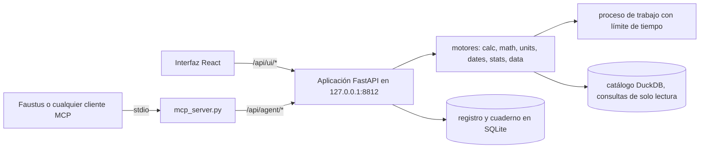

# Laplace's Hoard

### ¿Te fiarías de las cuentas de un modelo de lenguaje? Con este no hace falta.

**Un motor local de cálculo exacto, matemática simbólica, unidades, fechas, estadística y SQL sobre archivos para un modelo de lenguaje local: exacto cuando se puede, y con cada cálculo registrado con un id que el modelo cita y una persona puede volver a ejecutar.**

[English](README.md) · [Inicio rápido](#inicio-rápido) · [Conectar con Faustus](#conectarlo-a-faustus) · [Referencia MCP](docs/MCP.md) · [Portfolio](https://luissalet.github.io/Portfolio/#projects)


*Aplicación real, datos sintéticos de demostración (`--demo`), consultas reales.*

## Por qué

Los modelos de lenguaje hacen mal las cuentas, peor la estadística, y
"resumen" una tabla a partir de las primeras filas que ven. Un modelo local
de 27B te dirá que el 15 % de 2.347 es 351, que un CSV tiene "unas 1.200
filas" o que p = 0,06 es significativo, con toda naturalidad y sin avisar.
Laplace's Hoard le da al modelo motores exactos —`0.1 + 0.2` es el racional
`3/10` y `round(2.5)` es 3— o aproximados con la precisión indicada,
ejecuta SQL sobre el archivo real en lugar de dejar que el modelo adivine y
**registra cada cálculo** con un id como `L-000042`. La respuesta cita
`[L-000042]`; la persona lo abre en la interfaz, ve la entrada y la salida
exactas y puede repetirlo.

## Qué está implementado

| Área | Disponible ahora | Límite |
| --- | --- | --- |
| Aritmética exacta (`calc`) | `+ - * / // % **` (y `^`), comparaciones, `pct`, `pct_change`, `ratio`, raíces, logaritmos, trigonometría, `floor ceil round abs min max sum mean median factorial binomial gcd lcm mod isprime nextprime factorint`. Los literales son racionales exactos; el decimal sale con la precisión pedida (de 1 a 1000 cifras) y se indica cuándo está redondeado. Se analiza con una lista blanca del AST, nunca con `eval`/`sympify`. | Sin variables (para eso está `math`). Se rechazan las potencias exactas de más de unos seis millones de cifras; los resultados de más de 2.000 caracteres se recortan indicando el número de cifras. |
| Matemática simbólica (`math`) | `simplify expand factor apart together solve nsolve diff integrate limit series summation product matrix (det inv rank rref eigenvals transpose multiply) dsolve inequality`. `solve` sustituye cada raíz en la ecuación y devuelve `verified`. Si solo hay una variable, se deduce. | Cada llamada tiene un límite estricto de 10 s en un proceso aparte. `dsolve` cubre ecuaciones de primer orden `dy/dx = f(x, y)` escritas con símbolos simples, no con la notación `y(x)` de SymPy. |
| Unidades (`units_convert`) | Conversiones con Pint, cantidades compuestas ("5 ft 11 in"), temperaturas con su desplazamiento, comprobación de dimensiones y unidades compatibles. | Coma flotante, redondeada a 12 cifras significativas. Sin divisas (los tipos de cambio requieren red). |
| Fechas (`date_calc`) | Diferencias con desglose en años, meses y días, sumar días/meses/años, días laborables sin fines de semana ni festivos (por defecto España/Madrid, y cualquier país o región que conozca el paquete `holidays`), día de la semana, semana ISO, edad, zonas horarias, lectura de fechas ISO, numéricas con el día primero y en español ("3 de abril de 2026"), y "hoy". | Los días laborables cuentan los dos extremos salvo con `include_end=false`. Los festivos locales (de ciudad) son solo los que incluye el paquete `holidays`. |
| Estadística (`stats`) | `describe ttest_1samp ttest_ind (Welch) ttest_rel mannwhitneyu wilcoxon chi2_contingency fisher_exact pearson spearman linregress proportion_ci (Wilson) normal_ci binom_test`, con números pegados o con una columna de un dataset (todas las filas, con `group_by` y `where` opcionales), tamaños del efecto y una frase de interpretación neutral. | La interpretación solo habla de significación. Los resultados indefinidos (por ejemplo, una muestra constante) son errores, no NaN. |
| Datos (`data_*`) | Registrar CSV/TSV, Parquet, JSON/NDJSON, Excel (un dataset por hoja), SQLite (uno por tabla) o una carpeta de archivos - los números a la española (`-1.150,00`) se convierten en decimales exactos y se detectan los archivos Windows-1252, las fechas con el día primero y las filas de título sobre la cabecera de un Excel; esquema y perfil por columna (nulos, distintos, mín./máx., media/desviación, histograma, valores más frecuentes); SQL de DuckDB de solo lectura; gráficos (barras, líneas, área, dispersión, histograma, tarta, mapa de calor) en PNG para el modelo e interactivos en la interfaz; exportación a CSV del resultado completo. | Las consultas se ejecutan en una conexión de solo lectura, sin acceso a archivos ni descarga de extensiones, tras una validación que admite una sola sentencia. Lo que recibe el modelo está acotado (1.000 filas, 500 caracteres por celda). Los archivos de más de 1 GB se enlazan como vistas en lugar de copiarse. El registro se hace dentro de la propia petición (todavía no hay cola de tareas en segundo plano). |
| Registro y auditoría | Cada cálculo, desde la interfaz o desde el asistente, recibe un id, se puede buscar y repetir; "Actividad del asistente" muestra solo las llamadas del modelo. | La entrada y la salida guardadas se limitan a 20.000 caracteres por registro. |
| Pregunta a tus datos | Una pregunta en español o inglés en la pantalla de Datos envía al modelo de lenguaje compartido el esquema, el perfil por columna y hasta 5 filas de muestra de los datasets elegidos (nunca la tabla completa); debe responder con una sola consulta SQL, que pasa por la misma validación de solo lectura que cualquier otra consulta. El SQL se muestra y es editable, hay un reintento automático si falla, y la respuesta queda registrada (`engine="data"`, `operation="ask"`) con el nombre del modelo y un gráfico sugerido. | Solo interfaz - el agente ya escribe SQL por su cuenta con `data_query`. Necesita que la capacidad `llm` esté resuelta (ver "Modelos compartidos" más abajo); se desactiva mostrando el motivo cuando no hay ninguno disponible. |

## Casos de uso

Ocho recorridos concretos, hechos tanto por una persona en el navegador
como por un agente por MCP, están descritos en
[docs/USE_CASES.md](docs/USE_CASES.md) (lo que pasó al recorrerlos:
[docs/USABILITY_REPORT.md](docs/USABILITY_REPORT.md)). En resumen:

- **¿En qué se me va el dinero?** Registrar el extracto del banco tal cual
  llega (`;`, `03/04/2026`, `-1.150,00`, Windows-1252): los importes se
  convierten solos en números exactos; después, SQL por categoría, un
  gráfico y un CSV que abre bien un Excel en español.
- **"¿Cuánto me gasté en supermercados?"** Un agente encadena
  `data_register` → `data_query` → `calc` y cita cada número; `1.000` o
  `3,5` escritos a la española reciben un aviso o un error que dice cómo
  escribirlos.
- **Búsqueda de empleo.** Un Excel (se saltan las filas de título) → tasa
  de respuesta por modalidad → `fisher_exact` con una tabla 2×2 → días
  laborables desde la última candidatura, sin los festivos de Madrid.
- **Actividad y fototeca.** Un export JSON anidado o el catálogo SQLite de
  fotos: registrar sigue siendo pequeño (pista para `UNNEST`, los BLOB se
  muestran por su tamaño) y un gráfico vuelve como enlace, no como una
  imagen que nadie pidió.
- **Benchmarks.** `linregress` de la velocidad frente al contexto,
  descartando por pares las ejecuciones fallidas, y luego el resultado
  anterior buscado por su id.
- **Números del día a día.** IVA del 21 %, `72 pulgadas -> cm`, días
  laborables en Madrid hasta una fecha, en el cuaderno o en la pantalla de
  unidades y fechas.

## Inicio rápido

```
git clone https://github.com/Luissalet/LaplacesHoard.git
cd LaplacesHoard
```

### Windows

Haz doble clic en **`Iniciar Laplace's Hoard.cmd`**. La primera vez crea
`.venv` (preferiblemente con Python 3.13), instala
`requirements-lock.txt`, compila la interfaz si falta `frontend/dist`, y
después arranca la aplicación en segundo plano, espera a que responda
`/api/health` y abre el navegador. **`Detener Laplace's Hoard.cmd`** la
para. Lo mismo desde PowerShell:
`scripts\start.ps1 [-Port 8812] [-Demo] [-NoBrowser]` y `scripts\stop.ps1`.

Pasos manuales:

```powershell
py -3.13 -m venv .venv
.venv\Scripts\python -m pip install -r requirements-lock.txt
cd frontend; npm ci; npm run build; cd ..
.venv\Scripts\python -m laplaces_hoard
```

### Linux / macOS

Con Python 3.11 o posterior y Node 22:

```bash
python3 -m venv .venv
.venv/bin/python -m pip install -r requirements-lock.txt
(cd frontend && npm ci && npm run build)
.venv/bin/python -m laplaces_hoard --demo
```

La aplicación responde en `http://127.0.0.1:8812` (`curl http://127.0.0.1:8812/api/health`).
Los motores también se pueden usar como biblioteca, sin el servidor; por ejemplo,
`.venv/bin/python -c "from laplaces_hoard.engines import calc; print(calc.compute('0.1 + 0.2'))"`.

`--demo` usa `data-demo/`, con archivos sintéticos de ventas, sensores y
personal, en lugar de tu `data/`; `--port` y `--data-dir` (o
`LAPLACE_DATA_DIR`) cambian los valores por defecto; `--no-browser` evita
abrir una pestaña.


*Prueba t de Welch sobre una columna de un dataset, con el valor p primero y una interpretación neutral.*

## Modelos compartidos (HoardLink)

Laplace's Hoard incluye una copia de [HoardLink](https://github.com/Luissalet/HoardLink)
(`laplaces_hoard/hoard_link/`), un pequeño resolutor que comparten las
aplicaciones locales de la familia Hoard, para que "Pregunta a tus datos"
use el modelo de lenguaje que Faustus o un servidor local compatible con
la API de OpenAI (Ollama, llama.cpp u otro similar) ya tenga cargado, en
lugar de cargar una copia propia. Orden de resolución: configuración
manual en Ajustes, después el
propio registro de modelos de Faustus, y por último un servidor compartido
encontrado en loopback. Todo lo demás en esta aplicación —calc, math,
unidades, fechas, cada herramienta `data_*`— funciona por completo sin
ningún modelo; Ajustes → Modelos muestra exactamente qué hay disponible y
por qué, con un botón de volver a comprobar y configuración manual
(URL/token de Faustus, URL/modelo por capacidad).

## Conectarlo a Faustus

Laplace's Hoard es un plugin de [Faustus](https://github.com/Luissalet/Faustus)
y se declara con `faustus-plugin.json` en la raíz del repositorio. Arranca
la aplicación y en Faustus abre **Conectores → Aplicaciones cercanas →
Añadir**. Faustus la encuentra en el puerto 8812, comprueba `/api/health`,
lanza el adaptador MCP y carga la skill `exact-numbers`. El adaptador es
un script por stdio que se lanza por su ruta, con la URL de la aplicación
en `LAPLACE_URL`:

```powershell
$env:LAPLACE_URL = "http://127.0.0.1:8812"
.venv\Scripts\python.exe laplaces_hoard\mcp_server.py
```

### Herramientas MCP

| herramienta | solo lectura | qué hace |
| --- | --- | --- |
| `calc` | sí | Aritmética exacta, porcentajes, teoría de números |
| `math` | sí | Ecuaciones, derivadas, integrales, límites, series, matrices |
| `units_convert` | sí | Conversión de unidades |
| `stats` | sí | Estadística descriptiva y contrastes de hipótesis |
| `date_calc` | sí | Diferencias de fechas, días laborables, zonas horarias |
| `data_list` | sí | Datasets registrados |
| `data_register` | no | Añadir un archivo o una carpeta como dataset |
| `data_describe` | sí | Esquema, perfil, filas de muestra |
| `data_query` | sí | SQL de solo lectura |
| `data_chart` | sí | Gráfico como imagen |
| `work_log` | sí | Recuperar un cálculo anterior por su id |

Funciona con cualquier cliente MCP por stdio; en [docs/MCP.md](docs/MCP.md)
están la configuración, todos los argumentos, la forma de cada resultado y
sus límites.


*Llamadas reales hechas a través del adaptador MCP (`scripts/demo_agent_session.py`) sobre los datos de demostración.*

## Arquitectura



FastAPI sobre motores en Python puro (sin imports de FastAPI), SQLite para
el registro y el cuaderno, DuckDB para el catálogo de datos, un único
proceso de trabajo (contexto `spawn`) con límite de tiempo estricto para
todo lo que evalúa expresiones, y una interfaz en React. El adaptador MCP
es un script aparte que solo habla HTTP con la aplicación.
[docs/ARCHITECTURE.md](docs/ARCHITECTURE.md) explica el modelo de
conexiones, la validación SQL, el proceso de trabajo y la protección frente
al navegador.

## Desarrollo

```powershell
.venv\Scripts\python -m pytest -q
cd frontend; npm ci; npm run build
```

237 tests, sin red, en torno a un minuto. Cubren la lista blanca del AST
(`__import__`, atributos, lambdas, comprensiones), decimales y redondeo
exactos, precisión de hasta 1000 cifras, entradas desbocadas o que agotan
la memoria (límite de tiempo, recuperación, rechazo), llamadas simultáneas
al proceso de trabajo, la verificación de `solve`, los desplazamientos de
temperatura de Pint, la prueba t de Welch y otros resultados frente a
SciPy, días laborables con festivos de Madrid, fechas con el día primero y
en español, la validación SQL frente a toda sentencia que escribe o lee
archivos, registrar datos después de consultar, nombres de archivo con
espacios y tildes, hojas de Excel y tablas de SQLite como datasets, un
directorio de datos dentro de una carpeta con apóstrofo, los números del
perfil sobre una tabla conocida, los PNG de los gráficos, la ruta de
reserva de la SPA frente a path traversal, el formato de los errores, la
separación entre interfaz y asistente en el registro, el validador de
`faustus-plugin.json` y el propio protocolo MCP: el adaptador lanzado por
stdio contra la aplicación en marcha, listando herramientas (con palabras
clave y anotaciones en cada una) y llamando a `calc`, `data_register`,
`data_query`, `math`, `data_chart` (un `chart_url`, y la imagen solo si se pide) y `work_log`; los
endpoints de estado y configuración del modelo compartido (el token nunca
se devuelve) y "Pregunta a tus datos" contra un modelo de lenguaje simulado
(`httpx.MockTransport`): qué contiene el prompt (esquema y como mucho 5
filas de muestra), una respuesta SQL correcta, un reintento que incluye el
error, un error claro cuando el modelo no responde en SQL y el estado
honesto de "no disponible" sin ningún modelo resuelto; la configuración
guardada se puede borrar, se rechaza la que el formulario nunca envía y un
`backend.json` estropeado no impide arrancar la aplicación. Los recorridos
de los casos de uso añadieron tests de regresión para los CSV españoles
(separadores, codificaciones, volver a registrar), las filas de título de
Excel, las columnas BLOB y anidadas, las pistas de coma decimal en
`calc`/`math`, los mensajes de error del cuaderno y la exportación CSV en
español.

## Privacidad y seguridad

La aplicación solo escucha en `127.0.0.1` y no tiene telemetría. No hace
peticiones de red: los tipos de cambio y la descarga de festivos quedan
fuera de alcance, y la instalación automática de extensiones de DuckDB está
desactivada. Los datos se quedan en `data/` (ignorado por git) o donde
indique `--data-dir`; registrar un archivo lo copia al catálogo local y
nunca modifica el original. Un middleware rechaza el DNS rebinding
(cabecera `Host` incorrecta) y las escrituras desde otros sitios (`Origin`
ajeno o `Sec-Fetch-Site: cross-site`) en todas las rutas. Cada llamada a una
herramienta queda auditada en el registro con su origen (interfaz o
asistente), entrada, salida, duración y estado, y "Actividad del
asistente" muestra exactamente lo que ha ejecutado el modelo. Los scripts
de arranque de Windows se han probado con PowerShell 7 en Linux; la CI
ejecuta los tests en Ubuntu con Python 3.12 y compila la interfaz con
Node 22.

## Hoja de ruta / límites conocidos

- Algunos textos fijos de la interfaz siguen en inglés incluso en la
  versión española (mensajes de los motores, interpretaciones de los
  tests, nombres de los días, etiquetas de tipo de gráfico); está previsto
  traducirlos.
- Un dataset registrado por error no se puede borrar todavía desde la
  interfaz ni la API, solo volver a registrarlo encima.
- Añadir un archivo significa escribir o pegar su ruta; todavía no hay
  selector de archivos ni arrastrar y soltar.
- La respuesta de `list_tools` en MCP pesa bastante (unos 20.000
  caracteres, alrededor de 5k tokens, antes de la primera llamada), lo
  cual va bien con una ventana de contexto de 32k pero pesa con 8k. Antes
  de acortar las descripciones hay que medir si eso empeora la elección
  de herramientas en modelos pequeños.
- Las tarjetas de dataset y de perfil pueden desbordar horizontalmente en
  ventanas muy estrechas, y un gráfico muestra una categoría ausente como
  `null` en lugar de ocultarla.

El listado completo de asuntos abiertos y cómo se encontraron está en
[docs/USABILITY_REPORT.md](docs/USABILITY_REPORT.md).

## Licencia

MIT - ver [LICENSE](LICENSE).
