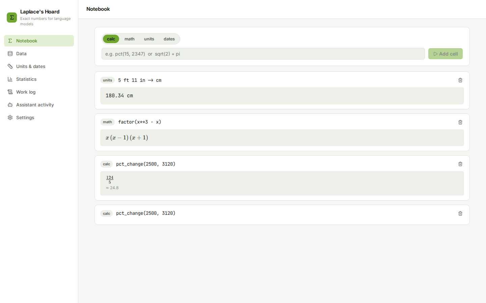

# Laplace's Hoard

### Would you trust a language model's arithmetic? This one doesn't have to.

**A local-first calculator, symbolic-math, units, statistics and SQL-over-files
tool for a local LLM workspace — every computation is exact where exactness
is possible, and logged with an id the model can cite and a human can
re-run.**

[Español](README.es.md) · [Run locally](#run-locally-on-windows) · [Connect an AI](docs/MCP.md) · [Portfolio](https://luissalet.github.io/Portfolio/#projects)


*Actual application, demo data (`--demo`), real computations.*

## Why

Language models are bad at arithmetic, worse at statistics, and they
"summarise" tables by eyeballing the first few rows. Ask one what 15% of
2,347 is, or whether a p-value of 0.03 is "significant", or how many
business days are between two dates in Madrid, and it will answer
fluently and sometimes wrong. Laplace's Hoard gives the model engines that
are *exact* — `0.1 + 0.2` is computed as the exact rational `3/10`, not a
floating-point approximation — or explicitly approximate with a stated
precision, and it **logs every computation** with an id (`L-000042`) so an
answer can cite its work and a human can open the same computation in the
UI and re-run it.

## What is implemented

| Area | Available now | Boundary |
| --- | --- | --- |
| Exact arithmetic (`calc`) | +,-,*,/,//,%,**, comparisons, percentages (`pct`, `pct_change`, `ratio`), `sqrt cbrt root exp log ln log10 log2` trig, `floor ceil round abs min max sum mean median factorial binomial gcd lcm mod isprime nextprime factorint`. Every literal is an exact `Rational`/`Integer`, never a lossy float. Runs through a whitelisted AST parser — never `eval`/`sympify` on raw text. | No variables in `calc` (use `math`); precision capped at 1000 significant digits. |
| Symbolic math (`math`) | `simplify expand factor apart together solve nsolve diff integrate limit series summation product matrix (det/inv/rank/rref/eigenvals/transpose/multiply) dsolve inequality`. `solve` verifies every root by substitution. Every call runs in a worker process with a hard timeout that self-heals if SymPy hangs. | `dsolve` only covers first-order ODEs written as `dy/dx = f(x, y)` in plain symbols (documented convention below) — SymPy's `y(x)`/`Derivative()` function-application syntax is deliberately not exposed through the safe parser. |
| Units (`units_convert`) | Pint-backed conversion, compound quantities ("5 ft 11 in"), correct temperature offsets, dimensional-consistency check, compatible-units listing. | No currency conversion — rates change and need network access this local tool does not perform on its own. |
| Dates (`date_calc`) | Calendar-aware diffs, adding days/weeks/months/years, business days excluding weekends and public holidays (default Spain/Madrid, any country/subdivision), weekday, ISO week, age, IANA time-zone conversion, free-text parsing. | Holiday calendars only as far as the `holidays` package's coverage. |
| Statistics (`stats`) | `describe ttest_1samp ttest_ind (Welch) ttest_rel mannwhitneyu wilcoxon chi2_contingency fisher_exact pearson spearman linregress proportion_ci (Wilson) normal_ci binom_test`, from inline numbers or a registered dataset column, with a neutral one-line interpretation. | The interpretation states significance only — never effect size or causation language beyond what SciPy reports. |
| Data catalogue (`data_*`) | Register CSV/TSV/Parquet/JSON/NDJSON/Excel (per sheet)/SQLite (per table)/a folder glob as a dataset; schema + per-column profile (nulls %, distinct, min/max, mean/sd, top-5 values); read-only SQL gated to `SELECT`/`WITH`/`DESCRIBE`/`SUMMARIZE`/`EXPLAIN`/one `PIVOT`; charts (bar/line/area/scatter/histogram/pie/heatmap) as PNG via Vega-Lite. | Files over 1 GB are queried as a lazy `VIEW` ("linked") instead of materialized; the read-only guarantee is enforced by the statement gate plus an always-rolled-back transaction rather than a second OS-level read-only DuckDB handle (this DuckDB version refuses two differently-configured connections to the same file — see `docs/ARCHITECTURE.md`). |
| Work log | Every computation (UI or assistant) gets an id, is listed, searchable, and re-runnable from the UI; the assistant's own calls are shown separately under "Assistant activity" for audit. | Log entries are capped at 20,000 characters of input/output each. |

## Connect it to Faustus

Laplace's Hoard declares itself to Faustus with `faustus-plugin.json` at the
repo root. Start the app, then in Faustus: **Connectors → Nearby apps →
Add**.

It also works with any MCP client (stdio) — see [docs/MCP.md](docs/MCP.md)
for the full tool table and a config snippet. Every tool result carries an
id like `L-000042`, meant to be cited as `[L-000042]`.

| tool | read-only | what |
| --- | --- | --- |
| `calc` | yes | Exact arithmetic and percentages |
| `math` | yes | Symbolic math (solve, calculus, matrices) |
| `units_convert` | yes | Unit conversion |
| `stats` | yes | Descriptive stats and hypothesis tests |
| `date_calc` | yes | Date arithmetic, business days, time zones |
| `data_list` | yes | List registered datasets |
| `data_register` | no | Register a file/folder as a dataset |
| `data_describe` | yes | Schema, profile, sample rows |
| `data_query` | yes | Read-only SQL |
| `data_chart` | yes | Chart as an image |
| `work_log` | yes | Recall a past computation by id |

## Run locally on Windows

Double-click **`Iniciar Laplace's Hoard.cmd`** (creates the venv, installs
dependencies, builds the frontend on first run, then starts the app and
opens a browser tab), or from PowerShell:

```powershell
python -m venv .venv
.venv\Scripts\pip install -r requirements-lock.txt
cd frontend; npm ci; npm run build; cd ..
.venv\Scripts\python -m laplaces_hoard
```

Add `--demo` to run against synthetic seeded data instead of your own
(`data-demo/` instead of `data/`), or `--port 8813 --data-dir D:\path` to
override defaults. `--no-browser` skips auto-opening a tab.

## Architecture

FastAPI + a set of pure-Python engines (no FastAPI imports) + SQLite for
the work log/notebook + DuckDB for the dataset catalogue. See
[docs/ARCHITECTURE.md](docs/ARCHITECTURE.md) for the data model, the
worker-process design for symbolic math, the SQL gate's exact rules, and
the browser-attack guard.

## Tests

```
.venv/bin/python -m pytest -q
```

83 tests, all offline, ~9 seconds. They cover: the AST whitelist (rejects
`__import__`, attribute access, lambdas, comprehensions, unknown names);
exact-decimal arithmetic (`0.1 + 0.2 == 3/10`); `solve` verification by
substitution; the symbolic worker's timeout-and-recovery; Pint temperature
offsets; Welch's t-test matching SciPy bit-for-bit; business days excluding
a real Madrid holiday; the SQL gate against every dangerous statement type
(`ATTACH`/`COPY`/`INSTALL`/`LOAD`/`PRAGMA`/multi-statement/...); Excel
sheet → dataset, SQLite table → dataset, folder-glob → dataset; profile
numbers checked against a known table; chart PNG magic bytes; the
`faustus-plugin.json` manifest checker; and the full MCP protocol — the
adapter spawned over real stdio against a live instance of the app,
listing tools and calling `calc` and `data_query`.

## Privacy and limits

Binds `127.0.0.1` only. No telemetry, no network access except when a
feature explicitly needs it (there is currently none that does — currency
rates and holiday-calendar downloads are both deliberately out of scope).
All data stays in `data/` (gitignored) unless you point `--data-dir`
elsewhere. The browser-attack guard middleware rejects DNS-rebinding
(wrong `Host` header) and cross-site writes (wrong `Origin`/
`Sec-Fetch-Site` on non-GET requests) on every route.
