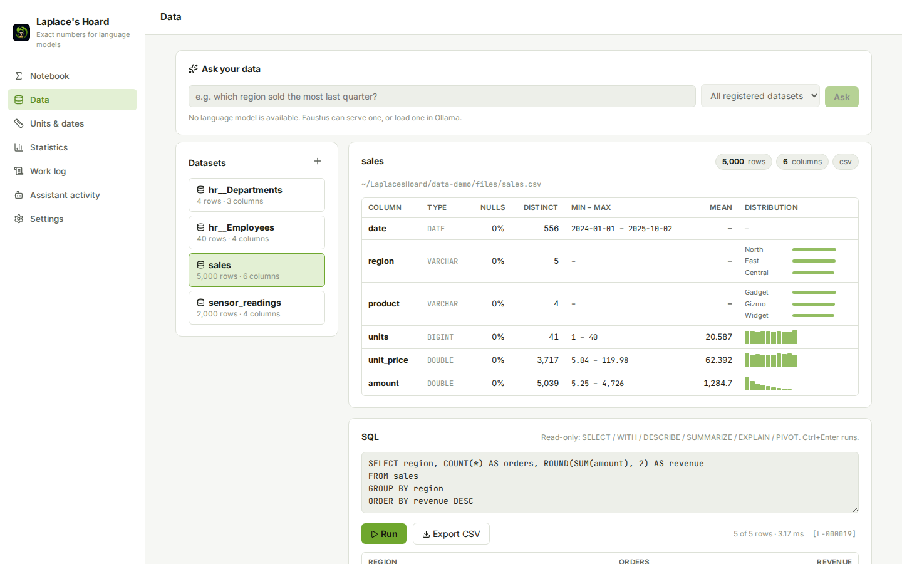
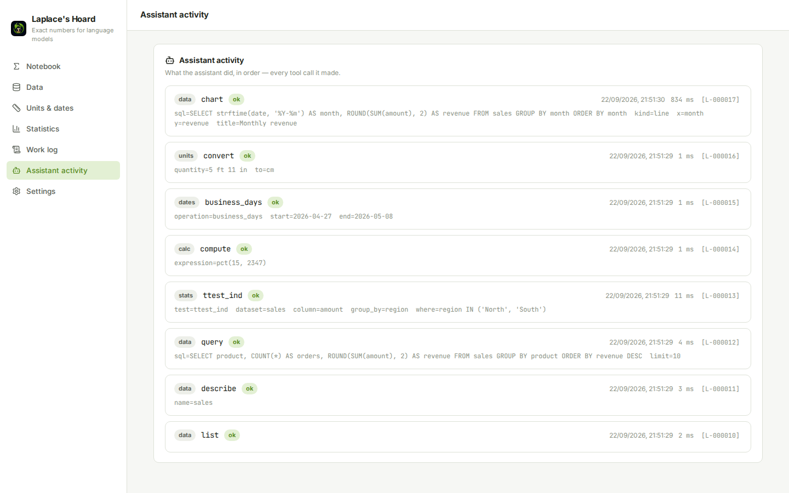
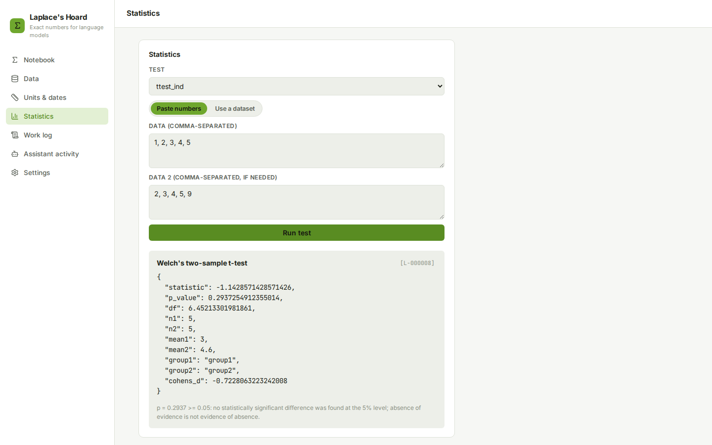

# Laplace's Hoard

### Would you trust a language model's arithmetic? This one doesn't have to.

**A local calculator, symbolic-math, units, dates, statistics and SQL-over-files engine for a local language model: exact where exactness is possible, and every computation logged with an id the model cites and a person can re-run.**

[Español](README.es.md) · [Run locally](#run-locally-on-windows) · [Connect an AI](docs/MCP.md) · [Portfolio](https://luissalet.github.io/Portfolio/#projects)


*Actual application, synthetic demo data (`--demo`), real queries.*

## Why

Language models are bad at arithmetic, worse at statistics, and they
"summarise" a table from the first rows they happen to see. A local 27B
model will say that 15% of 2,347 is 351, that a CSV has "about 1,200
rows", or that p = 0.06 is significant, fluently and without warning.
Laplace's Hoard gives the model engines that are exact — `0.1 + 0.2` is
the rational `3/10`, `round(2.5)` is 3 — or explicitly approximate with
the precision stated, runs SQL over the real file instead of letting the
model guess, and **logs every computation** with an id such as
`L-000042`. The answer cites `[L-000042]`; the human opens it in the UI,
sees the exact input and output, and can re-run it.

## What is implemented

| Area | Available now | Boundary |
| --- | --- | --- |
| Exact arithmetic (`calc`) | `+ - * / // % **` (and `^`), comparisons, `pct`, `pct_change`, `ratio`, roots, logs, trig, `floor ceil round abs min max sum mean median factorial binomial gcd lcm mod isprime nextprime factorint`. Literals are exact rationals; the decimal is given to the requested precision (1–1000 digits) and flagged when rounded. Parsed through an AST whitelist, never `eval`/`sympify`. | No variables (use `math`). Exact powers beyond about six million digits are refused; results over 2,000 characters are cut with the digit count. |
| Symbolic math (`math`) | `simplify expand factor apart together solve nsolve diff integrate limit series summation product matrix (det inv rank rref eigenvals transpose multiply) dsolve inequality`. `solve` substitutes every root back and reports `verified`. The variable is inferred when there is only one. | Each call has a hard 10 s timeout in a worker process. `dsolve` covers first-order `dy/dx = f(x, y)` written in plain symbols, not SymPy's `y(x)` notation. |
| Units (`units_convert`) | Pint conversions, compound quantities ("5 ft 11 in"), temperature offsets, dimensional checks, compatible units. | Floating point, rounded to 12 significant digits. No currencies (rates need the network). |
| Dates (`date_calc`) | Differences with calendar breakdown, adding days/months/years, business days excluding weekends and public holidays (default Spain/Madrid, any country/region the `holidays` package knows), weekday, ISO week, age, time zones, parsing of ISO, day-first numeric and Spanish dates ("3 de abril de 2026"), "today". | Business days count both ends unless `include_end=false`. Local (city) holidays are only those the `holidays` package includes. |
| Statistics (`stats`) | `describe ttest_1samp ttest_ind (Welch) ttest_rel mannwhitneyu wilcoxon chi2_contingency fisher_exact pearson spearman linregress proportion_ci (Wilson) normal_ci binom_test`, on inline numbers or a dataset column (every row, optional `group_by` and `where`), with effect sizes and one neutral sentence of interpretation. | The interpretation states significance only. Undefined results (e.g. a constant sample) are errors, not NaN. |
| Data (`data_*`) | Register CSV/TSV, Parquet, JSON/NDJSON, Excel (one dataset per sheet), SQLite (one per table) or a folder of files; schema and per-column profile (nulls, distinct, min/max, mean/sd, histogram, top values); read-only DuckDB SQL; charts (bar, line, area, scatter, histogram, pie, heatmap) as PNG for the model and interactive in the UI; full-result CSV export. | Queries run on a read-only connection with file access and extension downloads disabled, behind a one-statement gate. Model-facing results are capped (1,000 rows, 500 characters per cell). Sources over 1 GB are linked as views instead of copied. Registration runs in the request (no background job queue yet). |
| Work log and audit | Every computation from the UI or the assistant gets an id, is searchable and re-runnable; "Assistant activity" lists only the model's own tool calls. | Stored input/output is capped at 20,000 characters per entry. |
| Ask your data | A plain-English (or Spanish) question on the Data screen sends the shared language model the schema, per-column profile and up to 5 sample rows of the chosen datasets (never the full table); it must answer with one SQL query, which runs through the same read-only gate as every other query. The SQL is shown and editable, one retry happens automatically if it fails, and the answer is logged (`engine="data"`, `operation="ask"`) with the model's name and a suggested chart. | UI only - the agent already writes SQL itself via `data_query`. Needs a resolved `llm` capability (see "Shared models" below); disabled with the reason shown when none is available. |

## Shared models

Laplace's Hoard vendors Hoard Link, a small resolver shared with the
other Hoard apps, so "Ask your data" uses whichever language model
Faustus or a local Ollama/llama.cpp server already has loaded,
instead of loading a copy of its own. Resolution order: explicit override
in Settings, then Faustus's own model registry, then a shared server found
on loopback. Everything else in this app - calc, math, units, dates, every
`data_*` tool - works fully without any model at all; Settings → Models
shows exactly what is available and why, with a Re-check button and manual
overrides (Faustus URL/token, per-capability URL/model).

## Connect it to Faustus

Laplace's Hoard declares itself with `faustus-plugin.json` at the repo
root. Start the app, then in Faustus open **Connectors → Nearby apps →
Add**. Faustus finds it on port 8812, checks `/api/health`, launches the
MCP adapter and loads the `exact-numbers` skill.

| tool | read-only | what |
| --- | --- | --- |
| `calc` | yes | Exact arithmetic, percentages, number theory |
| `math` | yes | Solve, differentiate, integrate, limits, series, matrices |
| `units_convert` | yes | Unit conversion |
| `stats` | yes | Descriptive statistics and hypothesis tests |
| `date_calc` | yes | Date differences, business days, time zones |
| `data_list` | yes | Registered datasets |
| `data_register` | no | Add a file or folder as a dataset |
| `data_describe` | yes | Schema, profile, sample rows |
| `data_query` | yes | Read-only SQL |
| `data_chart` | yes | Chart as an image |
| `work_log` | yes | Recall an earlier computation by id |

It works with any MCP client over stdio; [docs/MCP.md](docs/MCP.md) has
the configuration snippet, every argument, output shape and limit.


*Real tool calls made through the MCP adapter (`scripts/demo_agent_session.py`) against the demo data.*

## Run locally on Windows

Double-click **`Iniciar Laplace's Hoard.cmd`**. The first run creates
`.venv` (Python 3.13 preferred), installs `requirements-lock.txt`, builds
the interface if `frontend/dist` is missing, then starts the app in the
background, waits for `/api/health` and opens the browser.
**`Detener Laplace's Hoard.cmd`** stops it. The same from PowerShell:
`scripts\start.ps1 [-Port 8812] [-Demo] [-NoBrowser]` and `scripts\stop.ps1`.

Manual steps:

```powershell
py -3.13 -m venv .venv
.venv\Scripts\python -m pip install -r requirements-lock.txt
cd frontend; npm ci; npm run build; cd ..
.venv\Scripts\python -m laplaces_hoard
```

`--demo` uses `data-demo/`, seeded with synthetic sales, sensor and HR
files, instead of your own `data/`; `--port` and `--data-dir` (or
`LAPLACE_DATA_DIR`) override the defaults; `--no-browser` skips opening a
tab.


*Welch's t-test run on a dataset column, with the p-value first and a neutral interpretation.*

## Architecture

FastAPI over pure-Python engines (no FastAPI imports), SQLite for the work
log and notebook, DuckDB for the dataset catalogue, one spawn-context
worker process with a hard timeout for everything that evaluates
expressions, and a React interface. The MCP adapter is a separate script
that only speaks HTTP to the app. [docs/ARCHITECTURE.md](docs/ARCHITECTURE.md)
covers the connection model, the SQL gate, the worker and the browser
guard.

## Tests

```powershell
.venv\Scripts\python -m pytest -q
```

174 tests, offline, about 35 seconds. They cover the AST whitelist
(`__import__`, attributes, lambdas, comprehensions), exact decimals and
rounding, precision up to 1000 digits, runaway and memory-bomb inputs
(timeout, recovery, refusal), concurrent calls through the worker, `solve`
verification, Pint temperature offsets, Welch's t-test and other results
against SciPy, business days across Madrid holidays, day-first and Spanish
dates, the SQL gate against every write and file-reading statement,
registration after queries, file names with spaces and accents, Excel
sheets and SQLite tables as datasets, a data directory under a folder with
an apostrophe, profile numbers on a known table, chart PNGs, the SPA
fallback against path traversal, the error envelope, the UI/assistant
split of the audit log, the `faustus-plugin.json` checker, and the MCP
protocol itself: the adapter spawned over stdio against a live app,
listing tools (keywords and annotations on each) and calling `calc`,
`data_register`, `data_query`, `math`, `data_chart` (image returned) and
`work_log`; the shared model backend's status/config endpoints (a token
is never echoed back) and "Ask your data" against a mocked language model
(`httpx.MockTransport`): what the prompt contains (schema, at most 5 sample
rows), a good SQL answer, one retry that carries the error, a clear error
when the model does not answer in SQL, and the honest "unavailable" state
with no model resolved; saved overrides can be cleared, a config the form
never sends is refused, and a broken `backend.json` does not stop the app.

## Privacy and limits

The app binds `127.0.0.1` only and has no telemetry. It makes no network
requests: exchange rates and holiday downloads are out of scope, and
DuckDB extension auto-install is disabled. Data stays in `data/`
(gitignored) or wherever `--data-dir` points; registering a file copies it
into the local catalogue and never modifies the original. A middleware
rejects DNS rebinding (wrong `Host`) and cross-site writes (foreign
`Origin` or `Sec-Fetch-Site: cross-site`) on every route. The Windows
launch scripts were exercised with PowerShell 7 on Linux; the test suite
runs on Linux here and is configured for Windows in CI.
